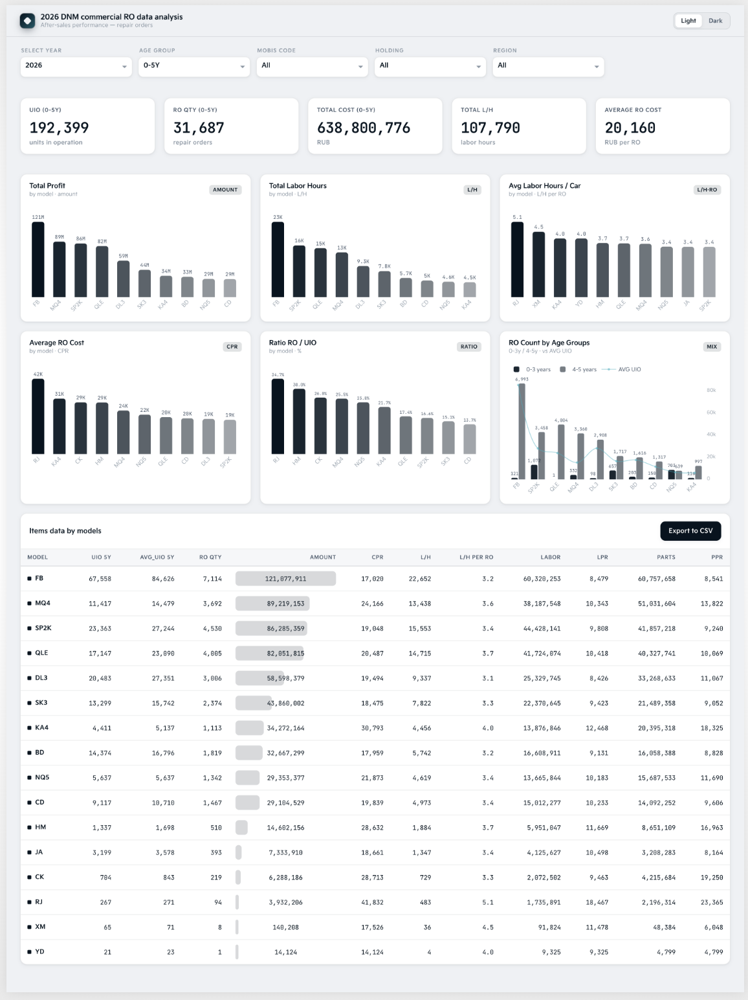

# DNM RO Dashboard

Интерактивный дашборд для анализа данных по заказ-нарядам (RO) по моделям автомобилей с фильтрацией по году, возрастной группе, дилеру, холдингу и региону. Тёмная и светлая темы на единой дизайн-системе.

## Описание

Дашборд предоставляет визуализацию ключевых метрик по моделям автомобилей:

> 📋 **Краткое описание функционала** — см. [FEATURES.md](FEATURES.md) для быстрого обзора основных возможностей и фильтров

- **Селектор года** — динамическое изменение данных по выбранному году
- **Селектор возрастных групп** — выбор между 0-5Y и 0-10Y для анализа
- Топ-10 моделей по общей прибыли
- Топ-10 моделей по нормо-часам
- Средние показатели по моделям
- Анализ заказ-нарядов по возрастным группам
- Интерактивная таблица с детальными данными
- **Темизация** — тёмная и светлая темы с мгновенным переключением
- **Адаптивный дизайн** — корректное отображение на всех устройствах



*Пример интерфейса дашборда*

## Функциональность

### Селекторы
- **Селектор года** — динамический выбор года (последние 5 лет + текущий год)
- **Селектор возрастных групп** — выбор между 0-5Y и 0-10Y для анализа данных
- **Селектор кода дилера (Mobis Code)** — фильтрация данных по конкретному дилеру
- **Селектор Holding** — фильтрация данных по холдингу
- **Селектор Region** — фильтрация данных по региону
- **Умная фильтрация Mobis Code** — при выборе Holding или Region автоматически фильтруются доступные Mobis Code
- **Отображение названий** — Dealer Name, Holding Name, Region Name выбранных значений
- **Автоматическое обновление** — все графики и метрики обновляются при смене параметров
- **Корректный расчет UIO** — для предыдущих годов используется 31 декабря выбранного года

### Графики
1. **Топ-10 по общей прибыли** — модели с наибольшим `total_ro_cost`
2. **Топ-10 по общим нормо-часам** — `labor_hours_0_10` / `labor_hours_0_5`
3. **Топ-10 по средним нормо-часам на автомобиль** — `aver_labor_hours_per_vhc`
4. **Топ-10 по среднему чеку** — `avg_ro_cost`
5. **Топ-10 по соотношению RO/UIO** — `ro_ratio_of_uio_10y` / производный показатель для 0-5Y
6. **RO Count by Age Groups** — количество заказ-нарядов по возрастным группам:
   - **0-5Y**: отдельные бары групп 0-3 и 4-5 лет + линия AVG UIO
   - **0-10Y**: отдельные бары групп 0-3, 4-5 и 6-10 лет + линия AVG UIO
   - Бары сгруппированы по моделям (`barmode='group'`), над каждым баром — количество RO
   - Линия AVG UIO — полупрозрачный сплайн на вторичной оси

**Все графики имеют:**
- Ранжированную прозрачность баров (топ-1 — самый насыщенный)
- Значения над барами в моноширинном шрифте
- **Региональные данные** — точки с региональными средними значениями на вторичной оси

### Региональный анализ
- **Автоматическое определение региона** — при выборе Mobis Code определяется соответствующий регион
- **Региональные оверлеи** — отображение средних значений по региону на всех основных графиках
- **Вторичная ось Y** — региональные данные отображаются на отдельной оси для корректного масштабирования
- **Фильтрация по топ-10** — региональные данные показывают только модели из топ-10 основного дилера

### Таблица данных
- Отсортирована по `total_ro_cost` по убыванию
- Исключены строки с нулевым `total_0_10`
- Приоритетный порядок столбцов, зебра, скрытие второстепенных колонок
- Форматирование чисел с разделителями тысяч

## Дизайн-система

Дашборд использует единую дизайн-систему (dark + light) с темизацией через CSS-переменные. Стили — library-native: один CSS-файл в `app/assets/` плюс тематизированные Plotly-фигуры. Никаких хардкод-цветов в компонентах.

### Модули

- **`app/assets/dashboard_theme.css`** — единственный источник стилей DOM: токены тем (`:root`, `html[data-theme="dark|light"]`), хедер, фильтр-бар, KPI-карточки, карточки графиков, таблица и адаптивные брейкпоинты. Темы переключаются установкой `data-theme` на `<html>` — смена атрибута ретемизирует весь DOM без перерисовки компонентов.
- **`app/plotly_templates.py`** — тематизированные построители фигур (единственный источник стилей графиков). `ranked_bar` — бары с ранжированной прозрачностью и оверлеем Region Average; `age_groups` — сгруппированные бары RO по возрастным группам + линия AVG UIO; `build_dashboard_figures` собирает все 6 фигур под выбранную тему. Plotly не читает CSS-переменные, поэтому фигуры перестраиваются на стороне сервера под тему.
- **`app/constants.py`** — данные дилеров и константы графиков: токены `THEMES`, акцент `ACCENT_2`, шрифтовые стеки, конфиг `dcc.Graph`. Токены `THEMES` держатся идентичными CSS — **меняешь цвет, меняй в обоих местах**.
- **`app/templates.py`** — минимальный `index_string`: стартовая тема через `data-theme`, импорт JetBrains Mono.
- **`app/components.py`** — переиспользуемые компоненты на классах дизайн-системы: поля фильтр-бара, KPI-карточки, карточки графиков, таблица.
- **`app/functions.py`** — загрузка и обработка данных, метрики, сборка контейнеров; построение графиков делегируется в `plotly_templates`.
- **`app/dnm.py`** — layout и колбэки: clientside-колбэк переключает `data-theme` на `<html>`, server-side колбэк перестраивает фигуры под тему.

### Цветовые токены

| Токен | Dark | Light |
|---|---|---|
| `--accent` | `#BFC2BF` | `#05141f` |
| `--accent-2` (AVG UIO / region) | `#16AFC0` | `#16AFC0` |
| `--bg` | `#05141f` | `#eef1f4` |
| `--surface` | `#0c2230` | `#ffffff` |
| `--text` | `#eef4f8` | `#05141f` |

Бренд-основа — Kia Signature navy `#05141f` + белый. Шрифты: KiaSignature (локальные woff2 в `app/assets/fonts/`) для UI, JetBrains Mono с `tabular-nums` для чисел и таблиц.

## Установка

### Требования
- Python 3.8+
- pip

### Шаги установки

1. **Клонируйте репозиторий:**
   ```bash
   git clone <repository-url>
   cd dnm_dashboard
   ```

2. **Создайте виртуальное окружение:**
   ```bash
   python -m venv venv
   source venv/bin/activate  # Linux/Mac
   # или
   venv\Scripts\activate     # Windows
   ```

3. **Установите зависимости:**
   ```bash
   pip install -r requirements.txt
   ```

4. **Для создания PDF-отчётов (опционально):**
   ```bash
   pip install selenium
   ```

> ⚠️ `app/constants.py` исключён из репозитория (`.gitignore`) — он содержит данные дилеров и константы графиков. Для запуска на новом окружении файл нужно создать локально.

## Использование

### Запуск дашборда

1. **Активируйте виртуальное окружение:**
   ```bash
   source venv/bin/activate  # Linux/Mac
   # или
   venv\Scripts\activate     # Windows
   ```

2. **Запустите дашборд:**
   ```bash
   python -m app.dnm
   ```

3. **Откройте браузер:**
   Перейдите по адресу: `http://127.0.0.1:8050/`

### Создание PDF-отчётов

```bash
python utils/save_dash.py
```

Создаёт PDF-версию дашборда. Для скриншот-метода требуется установленный Selenium и Chrome/ChromeDriver.

## Структура данных

### Источники данных
- **База данных PostgreSQL** — основной источник данных
- **CSV файлы** — резервный источник (fallback)

### Входные данные

Структура данных включает следующие ключевые поля:

| Поле | Описание |
|------|----------|
| `model` | Модель автомобиля |
| `uio_10y` / `uio_5y` | Количество автомобилей в возрасте до 10/5 лет |
| `avg_uio_10y` / `avg_uio_5y` | Среднегодовое UIO |
| `total_0_10` / `total_0_5` | Общее количество заказ-нарядов |
| `total_ro_cost` | Общая стоимость заказ-нарядов |
| `avg_ro_cost` | Средний чек заказ-наряда |
| `labor_hours_0_10` / `labor_hours_0_5` | Общие нормо-часы |
| `aver_labor_hours_per_vhc` | Средние нормо-часы на автомобиль |
| `ro_ratio_of_uio_10y` / `ro_ratio_of_uio_5y` | Соотношение RO к UIO |

### Возрастные группы
- `age_0_3` — автомобили 0-3 лет (используется для обеих групп)
- `age_4_5` — автомобили 4-5 лет (используется для обеих групп)
- `age_6_10` — автомобили 6-10 лет (только для группы 0-10Y)

## Система логирования

Настройки логирования находятся в файле `app/logging_config.py` (loguru):

- **app.log** — основные операции приложения
- **errors.log** — ошибки и исключения
- **sql_queries.log** — SQL запросы к базе данных с временем выполнения

Логи пишутся в каталог `logs/` с автоматической ротацией.

## Настройка

### Конфигурация базы данных
Настройте подключение к PostgreSQL в файле `config.py`:
```python
database:
  connection_params:
    host: "localhost"
    port: 5432
    database: "your_database"
    user: "your_username"
    password: "your_password"
```

### Изменение цветовой схемы
Цвета задаются в двух местах и должны совпадать:
- `app/assets/dashboard_theme.css` — CSS custom properties для DOM
- `app/constants.py` — токены `THEMES` и `ACCENT_2` для Plotly-фигур

### Настройка размера графиков
В `app/constants.py`:
```python
GRAPH_HEIGHT = 525  # Высота графиков в пикселях
```

### Настройка доступных годов
В файле `app/dnm.py` можно изменить диапазон доступных годов:
```python
available_years = list(range(current_year - 5, current_year + 1))
```

## Зависимости

### Основные
- `dash` — веб-фреймворк для дашбордов
- `pandas` — обработка данных
- `plotly` — создание интерактивных графиков
- `psycopg2` — подключение к PostgreSQL
- `loguru` — логирование

### Дополнительные (для PDF)
- `selenium` — автоматизация браузера для скриншотов
- `reportlab` — генерация PDF

## Структура проекта

```
dnm_dashboard/
├── app/                       # Основное приложение
│   ├── assets/                # Дизайн-система
│   │   ├── dashboard_theme.css  # Темы, токены, layout, таблица
│   │   └── fonts/             # KiaSignature woff2
│   ├── dnm.py                 # App, layout и callbacks
│   ├── functions.py           # Бизнес-логика и обработка данных
│   ├── components.py          # UI компоненты
│   ├── plotly_templates.py    # Тематизированные Plotly-фигуры
│   ├── constants.py           # Данные дилеров и константы (не в git)
│   ├── templates.py           # HTML шаблон (index_string)
│   └── logging_config.py      # Конфигурация логирования
├── database/                  # Работа с базой данных
│   ├── connection.py          # Подключение к БД
│   └── queries.py             # SQL запросы
├── SQL/                       # SQL скрипты
│   ├── dnm_script_age_0_10.sql            # Возрастная группа 0-10Y
│   ├── dnm_script_age_0_5.sql             # Возрастная группа 0-5Y
│   ├── dnm_script_age_0_10_by_region.sql  # Региональный запрос 0-10Y
│   ├── dnm_script_age_0_5_by_region.sql   # Региональный запрос 0-5Y
│   └── uio_by_dealer.sql                  # UIO по дилерам
├── data/                      # CSV данные (fallback)
├── utils/                     # Утилиты
│   └── save_dash.py           # Скрипт для создания PDF
├── tests/                     # Тесты
├── config.py                  # Конфигурация
├── requirements.txt           # Зависимости
└── README.md                  # Документация
```

## Возможные проблемы

### Ошибка подключения к базе данных
Если получаете ошибки подключения к PostgreSQL:
1. Проверьте настройки в `config.py`
2. Убедитесь, что PostgreSQL запущен
3. Проверьте права доступа пользователя
4. Дашборд автоматически переключится на CSV файлы

### Ошибка подключения к дашборду
Если получаете `ERR_CONNECTION_REFUSED` при создании PDF:
1. Убедитесь, что дашборд запущен
2. Проверьте, что порт 8050 свободен

### Проблемы с Selenium
Если возникают проблемы с автоматическими скриншотами:
1. Установите ChromeDriver
2. Обновите Selenium: `pip install --upgrade selenium`

## История версий

### Версия 3.0
- ✅ **Дизайн-система** — единый CSS-файл с токенами тем, dark + light
- ✅ **Темизированные Plotly-фигуры** — `plotly_templates.py` как единственный источник стилей графиков
- ✅ **Мгновенное переключение тем** — clientside-колбэк + CSS custom properties
- ✅ **Шрифты KiaSignature и JetBrains Mono**
- ✅ **График возрастных групп** — отдельные сгруппированные бары с подписями количества, полупрозрачная линия AVG UIO
- ✅ **Кэширование тяжёлых запросов**, чистый PDF-экспорт

### Версия 2.x
- Селекторы года, возрастных групп, Mobis Code, Holding, Region
- Умная фильтрация Mobis Code по Holding/Region
- Региональные оверлеи на графиках
- Модульная архитектура, подключение к PostgreSQL, адаптивный дизайн

## Лицензия

MIT License

Copyright (c) 2025 DNM Dashboard

Permission is hereby granted, free of charge, to any person obtaining a copy
of this software and associated documentation files (the "Software"), to deal
in the Software without restriction, including without limitation the rights
to use, copy, modify, merge, publish, distribute, sublicense, and/or sell
copies of the Software, and to permit persons to whom the Software is
furnished to do so, subject to the following conditions:

The above copyright notice and this permission notice shall be included in all
copies or substantial portions of the Software.

THE SOFTWARE IS PROVIDED "AS IS", WITHOUT WARRANTY OF ANY KIND, EXPRESS OR
IMPLIED, INCLUDING BUT NOT LIMITED TO THE WARRANTIES OF MERCHANTABILITY,
FITNESS FOR A PARTICULAR PURPOSE AND NONINFRINGEMENT. IN NO EVENT SHALL THE
AUTHORS OR COPYRIGHT HOLDERS BE LIABLE FOR ANY CLAIM, DAMAGES OR OTHER
LIABILITY, WHETHER IN AN ACTION OF CONTRACT, TORT OR OTHERWISE, ARISING FROM,
OUT OF OR IN CONNECTION WITH THE SOFTWARE OR THE USE OR OTHER DEALINGS IN THE
SOFTWARE.

## Поддержка

При возникновении проблем создайте issue в репозитории или обратитесь к разработчику.
