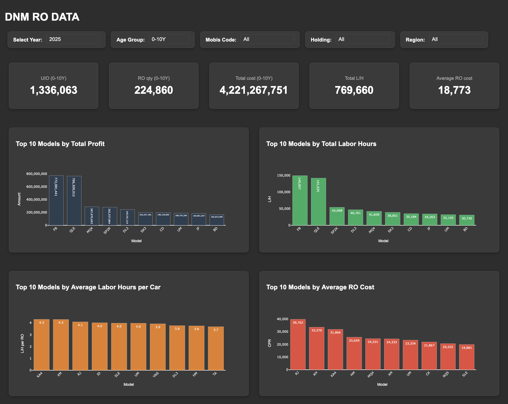

# DNM RO Dashboard

Интерактивный дашборд для анализа данных по заказ-нарядам (RO) по моделям автомобилей с возможностью выбора года и адаптивным дизайном.

## Описание

Дашборд предоставляет визуализацию ключевых метрик по моделям автомобилей:
- **Селектор года** - динамическое изменение данных по выбранному году
- **Селектор возрастных групп** - выбор между 0-5Y и 0-10Y для анализа
- Топ-10 моделей по общей прибыли
- Топ-10 моделей по нормо-часам
- Средние показатели по моделям
- Анализ заказ-нарядов по возрастным группам
- Интерактивная таблица с детальными данными
- **Адаптивный дизайн** - корректное отображение на всех устройствах



*Пример интерфейса дашборда*

## Функциональность

### Селекторы
- **Селектор года** - динамический выбор года (последние 5 лет + текущий год)
- **Селектор возрастных групп** - выбор между 0-5Y и 0-10Y для анализа данных
- **Селектор кода дилера (Mobis Code)** - фильтрация данных по конкретному дилеру
- **Селектор Holding** - фильтрация данных по холдингу
- **Умная фильтрация Mobis Code** - при выборе Holding автоматически фильтруются доступные Mobis Code
- **Отображение названия дилера** - показывает название выбранного дилера
- **Отображение названия Holding** - показывает название выбранного холдинга
- **Автоматическое обновление** - все графики и метрики обновляются при смене параметров
- **Корректный расчет UIO** - для предыдущих годов используется 31 декабря выбранного года

### Графики
1. **Топ-10 по общей прибыли** - модели с наибольшим `total_ro_cost` (ось Y: Amount)
2. **Топ-10 по общим нормо-часам** - модели с наибольшим `labor_hours_0_10` (ось Y: L/H)
3. **Топ-10 по средним нормо-часам на автомобиль** - `aver_labor_hours_per_vhc` (ось Y: L/H per RO)
4. **Топ-10 по среднему чеку** - `avg_ro_cost` (ось Y: CPR)
5. **Топ-10 по соотношению RO/UIO** - `ro_ratio_of_uio_10y` (ось Y: RO ratio from UIO 5Y/10Y)
6. **Количество заказ-нарядов по возрастным группам** - анализ по годам (ось Y: RO qty):
   - **0-5Y**: группы 0-3 и 4-5 лет
   - **0-10Y**: группы 0-3, 4-5 и 6-10 лет

**Все графики имеют:**
- Подписи осей, соответствующие заголовкам таблицы
- Жирное форматирование подписей (Arial, 14px)
- Ось X: "Model" для всех графиков

### Адаптивный дизайн
- **Мобильные устройства** (≤480px) - компактное отображение с уменьшенными графиками
- **Планшеты** (≤768px) - адаптированная сетка с полной шириной элементов
- **Десктоп** - полнофункциональный интерфейс с оптимальным использованием пространства

### Таблица данных
- Отсортирована по `total_ro_cost` по убыванию
- Исключены строки с нулевым `total_0_10`
- Приоритетный порядок столбцов
- Форматирование чисел с разделителями тысяч

## Установка

### Требования
- Python 3.8+
- pip

### Шаги установки

1. **Клонируйте репозиторий:**
   ```bash
   git clone <repository-url>
   cd dnm_dashboard
   ```

2. **Создайте виртуальное окружение:**
   ```bash
   python -m venv venv
   source venv/bin/activate  # Linux/Mac
   # или
   venv\Scripts\activate     # Windows
   ```

3. **Установите зависимости:**
   ```bash
   pip install -r requirements.txt
   ```

4. **Для создания PDF-отчётов (опционально):**
   ```bash
   pip install selenium
   ```

## Использование

### Запуск дашборда

1. **Активируйте виртуальное окружение:**
   ```bash
   source venv/bin/activate  # Linux/Mac
   # или
   venv\Scripts\activate     # Windows
   ```

2. **Запустите дашборд:**
   ```bash
   python app/dnm.py
   ```

3. **Откройте браузер:**
   Перейдите по адресу: `http://127.0.0.1:8050/`

### Создание PDF-отчётов

#### Метод 1: Обычный PDF (отдельные страницы)
```bash
python save_dash.py
```
Создаёт `dnm_dashboard.pdf` с каждым графиком на отдельной странице.

#### Метод 2: Одностраничный PDF (скриншот браузера)
```bash
python save_dash.py
```
Создаёт `dnm_dashboard_single.pdf` с точным отображением дашборда.

**Примечание:** Для метода 2 требуется установленный Selenium и Chrome/ChromeDriver.

## Структура данных

### Источники данных
- **База данных PostgreSQL** - основной источник данных
- **CSV файлы** - резервный источник (fallback)

### Входные данные

Структура данных включает следующие ключевые поля:

| Поле | Описание |
|------|----------|
| `model` | Модель автомобиля |
| `uio_10y` / `uio_5y` | Количество автомобилей в возрасте до 10/5 лет |
| `total_0_10` / `total_0_5` | Общее количество заказ-нарядов |
| `total_ro_cost` | Общая стоимость заказ-нарядов |
| `avg_ro_cost` | Средний чек заказ-наряда |
| `labor_hours_0_10` / `labor_hours_0_5` | Общие нормо-часы |
| `aver_labor_hours_per_vhc` | Средние нормо-часы на автомобиль |
| `ro_ratio_of_uio_10y` / `ro_ratio_of_uio_5y` | Соотношение RO к UIO |

### Возрастные группы
- `age_0_3` - автомобили 0-3 лет (используется для обеих групп)
- `age_4_5` - автомобили 4-5 лет (используется для обеих групп)
- `age_6_10` - автомобили 6-10 лет (только для группы 0-10Y)

## Настройка

### Конфигурация базы данных
Настройте подключение к PostgreSQL в файле `config.py`:
```python
database:
  connection_params:
    host: "localhost"
    port: 5432
    database: "your_database"
    user: "your_username"
    password: "your_password"
```

### Изменение цветовой схемы
В файле `app/styles.py` можно изменить палитру цветов:
```python
CHART_COLORS = [
    '#90a4ae',  # blue gray (calm)
    '#a5d6a7',  # soft green
    # ... другие цвета
]
```

### Настройка размера графиков
```python
GRAPH_HEIGHT = 350  # Высота графиков в пикселях
```

### Настройка доступных годов
В файле `app/dnm.py` можно изменить диапазон доступных годов:
```python
available_years = list(range(current_year - 5, current_year + 1))
```

### Фильтрация данных
- В таблице автоматически исключаются строки с `total_0_10 == 0`
- **Умная фильтрация Mobis Code**: при выборе конкретного Holding в выпадающем списке Mobis Code отображаются только те коды, которые относятся к выбранному холдингу
- **Примеры фильтрации**:
  - При выборе "KLYUCHAVTO" доступны: RS326, RS413, RS429, RS430, RS446, RS451, RS466, RS493, RS494, RS497, RS498
  - При выборе "FAVORIT" доступны: RS049, RS284, RS312, RS318, RS323, RS379
  - При выборе "TTS" доступны: RS112, RS175, RS227, RS307, RS339, RS440, RS457

## Зависимости

### Основные
- `dash` - веб-фреймворк для дашбордов
- `pandas` - обработка данных
- `plotly` - создание интерактивных графиков
- `psycopg2` - подключение к PostgreSQL
- `matplotlib` - создание статических графиков
- `reportlab` - генерация PDF

### Дополнительные (для PDF)
- `selenium` - автоматизация браузера для скриншотов

## Структура проекта

```
dnm_dashboard/
├── app/                   # Основное приложение
│   ├── dnm.py             # Основной файл дашборда (только app и callbacks)
│   ├── functions.py       # Бизнес-логика и обработка данных
│   ├── components.py      # UI компоненты
│   ├── constants.py       # Константы и данные дилеров
│   ├── styles.py          # Стили и темы
│   └── templates.py       # HTML шаблоны
├── database/              # Работа с базой данных
│   ├── connection.py      # Подключение к БД
│   └── queries.py         # SQL запросы
├── SQL/                   # SQL скрипты
│   ├── dnm_script_age_0_10.sql  # Запрос для возрастной группы 0-10Y
│   └── dnm_script_age_0_5.sql   # Запрос для возрастной группы 0-5Y
├── data/                  # Данные
│   ├── aug_25.csv         # Пример данных
│   └── jul_25.csv         # Пример данных
├── utils/                 # Утилиты
│   └── save_dash.py       # Скрипт для создания PDF
├── config.py              # Конфигурация
├── requirements.txt       # Зависимости
├── README.md              # Документация
└── venv/                  # Виртуальное окружение
```

## Возможные проблемы

### Ошибка подключения к базе данных
Если получаете ошибки подключения к PostgreSQL:
1. Проверьте настройки в `config.py`
2. Убедитесь, что PostgreSQL запущен
3. Проверьте права доступа пользователя
4. Дашборд автоматически переключится на CSV файлы

### Ошибка подключения к дашборду
Если получаете `ERR_CONNECTION_REFUSED` при создании PDF:
1. Убедитесь, что дашборд запущен
2. Проверьте, что порт 8050 свободен
3. Используйте обычный метод PDF

### Проблемы с Selenium
Если возникают проблемы с автоматическими скриншотами:
1. Установите ChromeDriver
2. Обновите Selenium: `pip install --upgrade selenium`
3. Используйте обычный метод PDF

### Проблемы с адаптивностью
Если дашборд некорректно отображается на мобильных устройствах:
1. Очистите кэш браузера
2. Проверьте, что CSS медиа-запросы загружаются
3. Убедитесь, что используется современный браузер

## Новые возможности

### Версия 2.3
- ✅ **Умная фильтрация Mobis Code** - при выборе Holding автоматически фильтруются доступные Mobis Code
- ✅ **Отображение названия Holding** - показывает название выбранного холдинга
- ✅ **Обновленные подписи графиков** - подписи осей соответствуют заголовкам таблицы
- ✅ **Жирное форматирование подписей** - улучшенная читаемость (Arial, 14px)
- ✅ **Рефакторинг кода** - модульная архитектура с разделением на functions.py
- ✅ **Строгое соответствие PEP 8** - стандартизация кода и структуры

### Версия 2.2
- ✅ **Селектор кода дилера (Mobis Code)** - фильтрация данных по конкретному дилеру
- ✅ **Селектор Holding** - фильтрация данных по холдингу
- ✅ **Отображение названия дилера** - показывает название выбранного дилера
- ✅ **Улучшенный UI** - все селекторы в едином стиле с консистентными отступами
- ✅ **Увеличенные шрифты** - улучшенная читаемость названия дилера
- ✅ **Соответствие PEP 8** - стандартизация кода с одинарными кавычками

### Версия 2.1
- ✅ **Селектор возрастных групп** - выбор между 0-5Y и 0-10Y для анализа
- ✅ **Двойные SQL скрипты** - отдельные запросы для каждой возрастной группы
- ✅ **Адаптивные графики** - разные возрастные группы в зависимости от выбора
- ✅ **Унифицированный UI** - селекторы в едином стиле с картами
- ✅ **Оптимизированный layout** - компактное размещение элементов

### Версия 2.0
- ✅ **Селектор года** - динамическое изменение данных по выбранному году
- ✅ **Адаптивный дизайн** - корректное отображение на всех устройствах
- ✅ **Модульная архитектура** - разделение кода на логические модули
- ✅ **Подключение к PostgreSQL** - работа с базой данных
- ✅ **Улучшенный UI** - современный дизайн с тенями и скруглениями
- ✅ **CSS медиа-запросы** - автоматическая адаптация под размер экрана

### Технические улучшения
- **Модульная архитектура**: разделение кода на `dnm.py` (app + callbacks), `functions.py` (бизнес-логика), `constants.py` (данные)
- **Умная фильтрация**: автоматическое обновление опций Mobis Code при выборе Holding
- **Улучшенные графики**: подписи осей соответствуют заголовкам таблицы с жирным форматированием
- **Параметризованные SQL запросы** с поддержкой возрастных групп
- **Callback система** для динамического обновления
- **Улучшенная обработка ошибок**
- **Строгое соответствие стандартам PEP 8** с одинарными кавычками
- **Модульная архитектура** селекторов и компонентов

## Лицензия

MIT License

Copyright (c) 2025 DNM Dashboard

Permission is hereby granted, free of charge, to any person obtaining a copy
of this software and associated documentation files (the "Software"), to deal
in the Software without restriction, including without limitation the rights
to use, copy, modify, merge, publish, distribute, sublicense, and/or sell
copies of the Software, and to permit persons to whom the Software is
furnished to do so, subject to the following conditions:

The above copyright notice and this permission notice shall be included in all
copies or substantial portions of the Software.

THE SOFTWARE IS PROVIDED "AS IS", WITHOUT WARRANTY OF ANY KIND, EXPRESS OR
IMPLIED, INCLUDING BUT NOT LIMITED TO THE WARRANTIES OF MERCHANTABILITY,
FITNESS FOR A PARTICULAR PURPOSE AND NONINFRINGEMENT. IN NO EVENT SHALL THE
AUTHORS OR COPYRIGHT HOLDERS BE LIABLE FOR ANY CLAIM, DAMAGES OR OTHER
LIABILITY, WHETHER IN AN ACTION OF CONTRACT, TORT OR OTHERWISE, ARISING FROM,
OUT OF OR IN CONNECTION WITH THE SOFTWARE OR THE USE OR OTHER DEALINGS IN THE
SOFTWARE.

## Поддержка

При возникновении проблем создайте issue в репозитории или обратитесь к разработчику.
